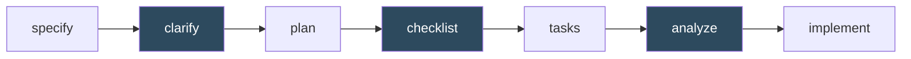

# 02. 품질 보강 (3종)

전부 **선택 사항**입니다. 없어도 워크플로우는 돌아갑니다. 다만 각각 끼어드는 자리가 정해져 있고, 그 자리를 놓치면 효과가 크게 떨어집니다.

| 스킬 | 끼어드는 자리 | 검사 대상 |
|---|---|---|
| [`/speckit-clarify`](#speckit-clarify) | `specify` 이후, **`plan` 이전** | 명세의 빈틈 |
| [`/speckit-checklist`](#speckit-checklist) | `plan` 이후 | 요구사항 문장의 품질 |
| [`/speckit-analyze`](#speckit-analyze) | `tasks` 이후, `implement` 이전 | 산출물 간 정합성 |

---

## `/speckit-clarify`

> Identify underspecified areas in the current feature spec by asking up to 5 highly targeted clarification questions and encoding answers back into the spec.

**역할** — 명세에서 덜 정해진 부분을 찾아 **최대 5개**의 표적 질문을 던지고, 답변을 `spec.md`에 다시 써넣습니다. 단순히 질문만 하는 게 아니라 결과가 명세에 반영되는 것이 핵심입니다.

**사용 시점** — `specify` 직후, **반드시 `plan` 이전**.

이 순서가 중요한 이유: `plan`은 `spec.md`를 입력으로 설계 산출물 4종(`research.md`, `data-model.md`, `contracts/`, `quickstart.md`)을 만듭니다. 계획을 세운 뒤에 명세가 바뀌면 그 산출물을 전부 다시 만들어야 합니다.

**입력** — (선택) 명확히 하고 싶은 영역 (예: "에러 처리 정책", "동시성 동작")

**산출물** — 갱신된 `specs/<feature>/spec.md`

**언제 건너뛰나** — 명세가 이미 충분히 구체적일 때. 판단 기준은 "`plan`이 추측 없이 설계할 수 있는가"입니다. `spec.md`에 `NEEDS CLARIFICATION` 표시가 남아 있다면 건너뛰지 마세요.

### `/speckit-decompose`와의 차이

둘 다 질문을 던지지만 목적과 한도가 다릅니다.

| | `clarify` | [`decompose`](07-decompose.md) |
|---|---|---|
| 대상 | 이미 존재하는 `spec.md` **하나** | 러프한 구상 또는 **비대해진** 스펙 |
| 질문 상한 | **최대 5개** | **없음 — 확정될 때까지** |
| 결과 | 같은 spec이 더 정밀해짐 | spec **여러 개**로 쪼개짐 |
| 위치 | `specify` **이후** | `specify` **이전** |

스펙이 흐릿하면 `clarify`, 스펙이 너무 크면 `decompose`입니다.

---

## `/speckit-checklist`

> Generate a custom checklist for the current feature based on user requirements.

**역할** — 스킬 문서가 직접 정의한 표현을 빌리면, **"영어로 쓴 요구사항에 대한 단위 테스트"** 입니다. 구현이 잘 돌아가는지가 아니라 **요구사항 문장 자체가 잘 쓰였는지**를 검사합니다.

이 구분이 이 스킬의 전부입니다:

| ❌ 이런 게 아님 (동작 검증) | ✅ 이런 것임 (요구사항 품질 검증) |
|---|---|
| "버튼이 제대로 클릭되는지 확인" | "모든 카드 타입에 시각적 위계 요구사항이 정의됐는가?" (완전성) |
| "에러 처리가 동작하는지 테스트" | "'눈에 띄게 표시'가 구체적 크기/위치로 정량화됐는가?" (명확성) |
| "API가 200을 반환하는지 확인" | "호버 상태 요구사항이 모든 인터랙티브 요소에서 일관적인가?" (일관성) |
| 코드가 명세와 맞는지 검사 | "로고 이미지 로드 실패 시 동작이 명세에 정의됐는가?" (엣지 케이스) |

**사용 시점** — `plan` 이후. 도메인별로 여러 번 실행할 수 있습니다.

**입력** — 도메인 또는 초점 영역 (예: `ux`, `api`, `security`, `performance`)

**산출물** — `specs/<feature>/checklists/<domain>.md`
- 파일명은 도메인 기반 짧은 이름 (`ux.md`, `api.md`, `security.md`, `performance.md`, `test.md` …)
- 항목 형식은 `- [ ] CHK### <요구사항 항목>`, ID는 `CHK001`부터 전역 증가
- 템플릿: `.specify/templates/checklist-template.md`

**참조** — 실행 시 `.specify/memory/constitution.md`가 존재하면 읽어서 프로젝트 원칙과 거버넌스 제약을 반영합니다. constitution을 먼저 채워두면 체크리스트 품질이 올라갑니다.

---

## `/speckit-analyze`

> Perform a non-destructive cross-artifact consistency and quality analysis across spec.md, plan.md, and tasks.md after task generation.

**역할** — `spec.md` / `plan.md` / `tasks.md` **세 문서를 교차 대조**해 서로 어긋나는 곳을 찾습니다. 명세에는 있는데 작업에는 없는 항목, 계획에 없는 작업이 끼어든 경우 등을 잡아냅니다.

**비파괴적(non-destructive)** — 파일을 수정하지 않고 보고서만 냅니다. 셋 중 유일하게 산출물을 건드리지 않는 스킬이라, 부담 없이 돌려볼 수 있습니다.

**사용 시점** — `tasks` 이후, `implement` 이전. 이 위치여야 세 문서가 모두 존재합니다.

**입력** — (선택) 분석 초점 영역

**산출물** — 분석 보고 (파일 수정 없음)

**`converge`와의 차이** — 헷갈리기 쉬운 한 쌍입니다.

| | `analyze` | `converge` |
|---|---|---|
| 대조 대상 | 문서 ↔ 문서 | **코드** ↔ 문서 |
| 시점 | `implement` **이전** | `implement` **이후** |
| 파일 수정 | 안 함 | `tasks.md`에 작업 추가 |
| 답하는 질문 | "계획이 앞뒤가 맞는가?" | "실제로 다 만들었는가?" |
