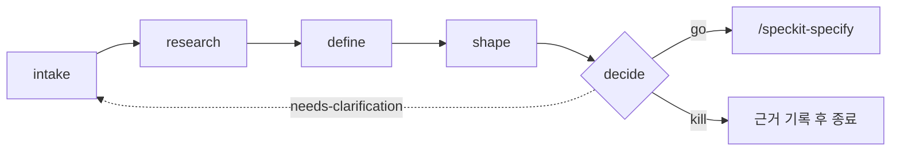

# 03. 아이디어 평가 파이프라인 (5종)

> 확장: `assess` — *Idea Assessment Pipeline*

SDD의 **Discovery 트랙**입니다. 아이디어가 구현 트랙에 들어가기 **전에** 방어 가능한 `go` / `needs-clarification` / `kill` 판정을 내립니다.

- Discovery = *이걸 만들 가치가 있나?* ← 이 문서
- Delivery = *어떻게 만드나?* ← [01-core-workflow](01-core-workflow.md)

**핵심 사고방식** — 이 파이프라인은 **깔때기**입니다. 대부분의 아이디어는 `shape`에 도달하기 전에 죽거나 보류되어야 정상입니다. 확장 문서가 명시하듯, **근거를 남기고 아이디어를 죽이는 것은 실패가 아니라 성공적인 결과**입니다.

---

## 흐름과 산출물

각 아이디어는 `.specify/assessments/<slug>/` 아래 자기 디렉터리를 갖고, 단계마다 마크다운 하나를 남깁니다.

```
.specify/assessments/<slug>/
├── intake.md      # speckit-assess-intake    — 날것의 아이디어 포착
├── research.md    # speckit-assess-research  — 근거 수집 (반대 근거 포함)
├── problem.md     # speckit-assess-define    — 문제 정의, 목표, 지표
├── concept.md     # speckit-assess-shape     — 해법 옵션과 appetite
└── decision.md    # speckit-assess-decide    — 판정 → 핸드오프
```



---

## 게이팅 규칙

순서대로 도는 것이 기본이지만 **엄격하게 강제되지는 않습니다**. 실제 전제조건은 이것뿐입니다.

| 단계 | 전제조건 |
|---|---|
| `intake` | 없음 |
| `research` | 없음 (권장: `intake.md`) |
| **`define`** | 없음 — **최소 실행 가능 단계.** intake/research 없이 사용자 입력만으로 바로 실행 가능 |
| `shape` | `problem.md` **필수** |
| `decide` | `problem.md` **필수**. `concept.md`가 없으면 `go` 판정이 `needs-clarification`으로 강등됨 |

즉 급할 때의 최단 경로는 **`define` → `shape` → `decide`** 3단계입니다.

**전제조건** — 초기화된 Spec Kit 프로젝트만 있으면 됩니다. **소스 코드가 하나도 없어도 무방합니다.** 갓 초기화한 빈 프로젝트나 기존 코드베이스나 똑같이 동작합니다.

---

## slug 규칙

`slug`는 `.specify/assessments/` 아래 아이디어별 디렉터리 이름이며, 5개 커맨드가 공유하는 손잡이입니다.

- **사용자 지정** — 소문자 kebab-case로 정규화 (`offline-mode`, `cut-onboarding-friction`). 정규화 후 그대로 보존되며 타임스탬프나 번호가 붙지 않습니다.
- **질문** — 대화형에서 slug 없이 `intake`를 부르면, 아이디어에서 유도한 kebab-case 기본값을 제안하며 물어봅니다.
- **자동 생성** — 사람이 없으면 에이전트가 고유 slug를 만듭니다. **기존 평가 디렉터리는 절대 덮어쓰지 않습니다** (`-2`, `-3`, 또는 짧은 날짜를 덧붙임).
- **재사용** — 같은 세션의 뒤 단계는 앞서 보고된 slug를 디렉터리 존재로 확인한 뒤 재사용합니다.

---

## `/speckit-assess-intake`

**역할** — 날것의 아이디어를 포착해 정규화합니다.

**입력 형태** — 붙여넣은 텍스트, URL, 티켓, 또는 **코드베이스 포인터**. 앞의 셋은 기존 코드가 필요 없고, 코드베이스 포인터는 이미 존재하는 코드에 대한 아이디어를 평가할 때 씁니다. 어느 쪽이 더 "올바른" 출발점이라는 건 없습니다.

**산출물** — `intake.md`

**사용 시점** — 아이디어가 아직 말로만 있을 때. 머릿속 생각을 남이 읽을 수 있는 형태로 만드는 단계입니다.

---

## `/speckit-assess-research`

**역할** — 사용자, 시장, 선행 사례(prior art), 데이터에서 근거를 모읍니다.

**중요** — 아이디어를 **지지하는** 근거뿐 아니라 **반박하는** 근거도 함께 모으도록 설계돼 있습니다. 이 단계를 확증 편향의 도구로 쓰면 파이프라인 전체가 무의미해집니다.

**산출물** — `research.md`

**사용 시점** — 아이디어의 전제가 사실인지 확인해야 할 때. 이미 근거가 충분하면 건너뛰어도 됩니다.

---

## `/speckit-assess-define`

**역할** — 문제를 정의합니다. 누가 영향받는가, 무엇이 아픈가, 목표와 **비목표(non-goals)**, 성공 지표, 그리고 **방치 비용(cost of inaction)**.

**산출물** — `problem.md`

**사용 시점** — 파이프라인의 **최소 실행 가능 단계**. 딱 하나만 돌린다면 이것입니다. `shape`과 `decide` 모두 이 파일을 요구합니다.

**왜 중요한가** — 비목표와 방치 비용이 여기서 정해집니다. 이 둘이 없으면 `decide`가 판정할 기준 자체가 없습니다.

---

## `/speckit-assess-shape`

**역할** — 개념 수준의 해법 옵션 **2~3개**를 만들고 appetite(투자할 의향이 있는 규모)와 트레이드오프를 붙인 뒤, 하나를 추천합니다 — **또는 아무것도 추천하지 않습니다.**

**산출물** — `concept.md`

**전제조건** — `problem.md` 필수

**사용 시점** — 문제가 정의된 뒤, 판정 전.

**주의** — 구현 설계가 **아닙니다**. 여기서 아키텍처를 그리기 시작하면 `plan`의 일을 미리 하는 셈이고, 아직 만들지 않기로 할 수도 있는 것에 설계 비용을 쓰는 겁니다.

---

## `/speckit-assess-decide`

**역할** — 기준에 따라 점수를 매기고 판정을 내립니다.

| 판정 | 의미 | 다음 |
|---|---|---|
| `go` | 만들 가치가 있음 | `/speckit-specify`로 핸드오프 |
| `needs-clarification` | 판단 불가 | 지목된 이전 단계로 되돌아감 |
| `kill` | 만들지 않음 | 근거를 기록하고 종료 — **정상적인 성공 결과** |

**산출물** — `decision.md`

**전제조건** — `problem.md` 필수. `concept.md`가 없으면 `go`를 낼 수 없고 `needs-clarification`으로 강등됩니다.

**사용 시점** — Discovery 트랙의 종점. 여기서 `go`가 나온 것만 [01-core-workflow](01-core-workflow.md)로 넘어갑니다.
