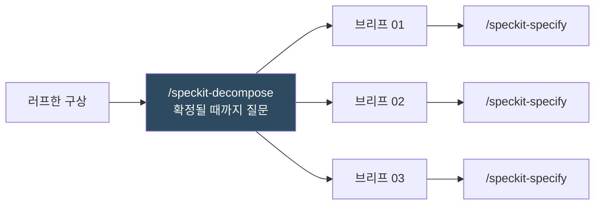

# 07. 스펙 분해 (1종)

> **자체 제작 스킬** — spec-kit 공식 배포물이 아닙니다.

`/speckit-specify` **앞단**에 붙는 스킬입니다. 러프하거나 너무 큰 구상을 받아 **사용자가 확정할 때까지 질문**한 뒤, 각각 독립적으로 명세화할 수 있는 **여러 개의 스펙 브리프**로 쪼갭니다.

---

## 왜 필요한가

시스템 전체를 스펙 하나에 담으면 `/speckit-plan`이 실행 불가능한 계획을 내놓고, `/speckit-tasks`가 끝나지 않는 작업 목록을 만듭니다. 먼저 쪼갠 뒤, 조각마다 `/speckit-specify`를 돌리는 것이 이 스킬의 전제입니다.



**이 스킬은 스펙을 쓰지 않습니다.** 명확화된 개요와 범위가 정해진 *브리프*만 만듭니다. 진짜 `spec.md`는 `/speckit-specify`가 만듭니다.

---

## `/speckit-decompose`

> Clarify a rough or oversized spec through an unbounded question loop, then split it into multiple independently-specifiable specs.

**입력** — 세 가지 형태를 받습니다.

| 입력 | 동작 |
|---|---|
| 러프한 내용 (문단, 브레인덤프, 초안, 비대해진 `spec.md`) | 신규 분해 |
| `slug=<name>` | 기존 분해를 다시 염 |
| 둘 다 | 새 정보를 반영해 기존 분해 갱신 |

**거칠어도 됩니다 — 그게 이 스킬의 목적입니다.**

**산출물** — `.specify/decompositions/<slug>/`

```
.specify/decompositions/<slug>/
├── overview.md           # 확정된 전체 스코프
├── decisions.md          # 모든 Q&A (append-only)
├── handoff.md            # 순서·의존성·파일별 상태
└── specs/
    ├── 01-<name>.md      # 의존성 순서로 번호 매김
    ├── 02-<name>.md
    └── …
```

---

## 동작 방식

### 3단계 모드

실행 시작 시 모드를 판정해 사용자에게 알립니다.

| 조건 | 모드 | 동작 |
|---|---|---|
| 디렉터리 없음 | **New** | Phase 1→4 전체 실행 |
| 있고, 마지막 확정 이후 변경 없음 | **Extend** | 재확인 후 새 입력 반영 |
| 있고, md가 손으로 수정됨 | **Revision** | 변경분 재질문 → 재확정 |

### Phase 1 — 전체를 명확히

아직 **아무것도 쪼개지 않습니다.** 먼저 입력을 자기 말로 되짚어 오독을 즉시 잡고, 다음 범주를 **Clear / Partial / Missing**으로 스캔합니다.

- 전체 목표와 성공 정의 / 명시적 out-of-scope
- 액터·사용자 / 주요 능력(분할 축 후보)
- 능력 경계를 넘나드는 데이터·엔티티
- 외부 의존성 / 제약(플랫폼, 성능, 오프라인)
- 선후 제약 — 무엇이 무엇보다 먼저 있어야 하는가
- 분할된 스펙들이 공유해야 할 용어

Partial/Missing인 항목마다 질문 루프를 돌립니다.

### Phase 2 — 분할안 협의

**2~3개 후보안**을 근거와 함께 제시합니다. 분할 축은 내용이 실제로 지지하는 것을 고르며, 억지로 끼워맞추지 않습니다.

| 축 | 성격 |
|---|---|
| 사용자 가시 능력 | 각 스펙이 독립 출하 가능 |
| 파이프라인 단계 | 각 스펙이 사슬의 한 변환 |
| 아키텍처 레이어 | 데이터 / 로직 / UI |
| 리스크 격리 | 불확실한 부분을 확실한 부분에서 분리 |

각 후보마다 **정직하게** 밝힙니다: 스펙 개수와 크기, 각각이 독립적으로 가치 있는지 아니면 형제가 나와야만 쓸모 있는지, 의존성 간선, 그리고 **이 분할로 무엇이 더 어려워지는지** — 비용은 항상 존재하며 반드시 명시합니다.

확정 전 검증: 모든 능력이 정확히 한 브리프에 속하는가(고아·중복 없음), 순환 의존이 없는가, 각 스펙에 검증 가능한 수용 신호가 있는가, 유독 큰 스펙이 있는가(있으면 추가 분할 질문).

### Phase 3~4 — 작성과 핸드오프

브리프를 쓰고 `handoff.md`에 순서를 기록합니다. **스킬이 `/speckit-specify`를 직접 부르지 않습니다** — 매 호출이 `before_specify` 필수 훅으로 피처 브랜치를 만들기 때문에, 연달아 실행하면 예상치 못한 브랜치에서 작업이 뒤섞입니다. 순서만 알려주고 사용자가 직접 몹니다.

---

## 질문 프로토콜

이 스킬의 핵심이며, 모든 대화 단계를 지배합니다.

**질문 개수 상한이 없습니다.** `/speckit-clarify`가 최대 5개로 제한되는 것과 **의도적으로 다릅니다**. 사용자가 명시적으로 확정할 때까지 계속 묻습니다.

| 규칙 | 내용 |
|---|---|
| 한 번에 하나 | 묶어서 던지지 않고, 다음 질문을 미리 노출하지 않음 |
| 항상 추천 먼저 | `**Recommended:** Option X — 이유` 후 선택지 표. "yes" 한 마디로 수락 가능 |
| 분해를 바꾸는 질문만 | 기술 선택·파일 구조는 `/speckit-plan`의 몫 → `## Deferred to Planning`에 기록 |
| 즉시 기록 | 수락된 답은 곧바로 `decisions.md`에 씀 (메모리에만 두지 않음) |
| 주기적 종료 제안 | 3개마다, 그리고 큐가 빌 때마다 "이대로 확정할까요?" |
| 조기 종료 존중 | "그만"에 따르되, 미해결 항목을 `## Unresolved`에 남기고 보고 |

답을 지어내지 않습니다. 사용자가 결정 못 하면 `[NEEDS CLARIFICATION: …]`으로 넘깁니다.

---

## 수정된 md 재질문

**손으로 고친 md는 최초 입력과 똑같이 취급됩니다 — 확정될 때까지 다시 질문합니다.**

각 브리프는 본문 해시(`Body-Hash`)를 헤더에 들고 있고, `handoff.md`가 그 값을 추적합니다. 재실행 시:

1. 해시를 다시 계산해 불일치를 찾습니다 (`Get-FileHash` / `sha256sum`)
2. 수정된 브리프 + **그것에 의존하는 모든 브리프**를 `stale`로 표시 — 수정은 하류로 전파됩니다
3. 무엇이 바뀌었는지 원시 diff가 아니라 **의미 차이**로 보여줍니다
4. 질문 루프를 돌립니다:
   - 범위가 경계를 넘어갔나 → 잃거나 얻은 형제 스펙도 바뀌어야 함
   - `overview.md`와 모순되나 → 어느 쪽이 이기는지 묻고 진 쪽을 갱신
   - 새 능력이 생겼나 → 여기인지, 형제인지, 새 브리프인지
   - 의존 간선이 끊기거나 순환이 생겼나 → 해소 방법
5. 확정 후에만 `Revision` 증가, 해시 재계산, 상태를 `confirmed`로 복귀
6. Q&A는 `decisions.md`에 `## Revision N` 제목으로 **추가**. 이전 이력은 절대 다시 쓰지 않습니다

해시 계산이 불가능한 환경이면 `unset`으로 쓰고, 전체 재검토로 폴백한다고 보고합니다.

---

## 경계

- **쓰기는 `.specify/decompositions/<slug>/` 안으로 한정.** 소스 파일, `specs/`, `spec.md`는 건드리지 않습니다 (읽기는 저장소 전체 가능)
- `/speckit-specify`·`/speckit-plan`·`/speckit-tasks`를 **직접 호출하지 않습니다**
- 확정되지 않은 분할은 만들지 않습니다 — 제안은 결정이 아닙니다
- 능력을 조용히 누락시키지 않습니다 — 모든 항목이 한 브리프에 있거나 `## Out of Scope`에 이유와 함께 있어야 합니다
- `decisions.md`는 append-only. 분할이 왜 이 모양인지에 대한 기록입니다
- 입력이 너무 빈약하면(내용 없는 한 문장) 5개로 지어내지 않고 더 달라고 요청합니다
- **결과가 스펙 1개여도 정상입니다** — 그렇게 말하고 `/speckit-specify`로 바로 보냅니다

---

## ⚠️ 업그레이드 시 주의

이 스킬은 **자체 제작**이며 spec-kit 공식 배포물이 아닙니다. `.specify/extensions/.registry`에 등록되어 있지 않고, `SKILL.md` 프론트매터에 `author: local`로 표시돼 있습니다.

향후 spec-kit이 동명의 공식 스킬을 배포하면 `specify integration upgrade` 시 **덮어쓰일 수 있습니다.** 업그레이드 전에 이 파일을 백업하거나, 덮어쓰인 뒤 git에서 복원하세요.

```powershell
git checkout -- .claude/skills/speckit-decompose/SKILL.md
```

훅 키로 `before_decompose` / `after_decompose`를 확인하지만, 현재 어떤 확장도 이 키를 등록하지 않으므로 조용히 건너뜁니다. 나중에 auto-commit을 이 스킬에도 걸고 싶다면 `.specify/extensions.yml`에 해당 키를 추가하면 됩니다.
