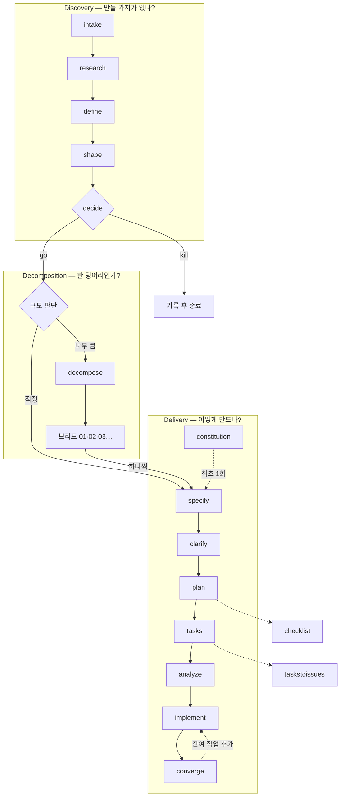

# Spec Kit 스킬 가이드

이 프로젝트에 설치된 **25개 스킬**(공식 24 + 자체 제작 1)의 역할, 사용 시점, 실행 순서를 정리한 문서입니다.

- 설치 버전: `specify` CLI `0.14.3.dev0` (프로젝트 스캐폴딩은 `0.12.3.dev0`으로 생성)
- 인테그레이션: `claude` / 스크립트 타입: `ps` (PowerShell)
- 확장: `git`, `agent-context`, `bug`, `assess` (core 4종 전부)
- 자체 제작: [`/speckit-decompose`](07-decompose.md) — 공식 배포물이 아니며 업그레이드 시 덮어쓰일 수 있음

> **슬래시 커맨드 표기**
> Spec Kit의 정식 커맨드 ID는 점 표기(`speckit.specify`)지만, Claude Code는 하이픈 구분자를 씁니다.
> 이 문서는 실제로 입력하는 형태인 **`/speckit-specify`** 로 표기합니다.

---

## 두 개의 트랙

Spec Kit은 성격이 다른 두 흐름으로 나뉩니다. 이 구분을 놓치면 스킬 24개가 그냥 뒤섞인 목록으로 보입니다.

| 트랙 | 묻는 질문 | 담당 스킬 |
|---|---|---|
| **Discovery (발견)** | *이걸 만들 가치가 있나?* | `assess` 5종 |
| **Decomposition (분해)** | *한 덩어리인가, 여러 개인가?* | `decompose` 1종 |
| **Delivery (구현)** | *어떻게 만들 것인가?* | core 워크플로우 + 품질 보강 |

Discovery를 통과(`go`)한 아이디어만 다음으로 넘어갑니다. 이미 만들기로 결정된 일이라면 Discovery는 건너뜁니다. 구상이 시스템 전체를 덮을 만큼 크면 `/speckit-specify` 전에 `/speckit-decompose`로 먼저 쪼갭니다.



점선은 선택 단계입니다.

---

## 표준 실행 순서

가장 흔한 경로입니다. 굵은 항목이 필수입니다.

| # | 스킬 | 필수 | 하는 일 |
|---|---|:---:|---|
| 0 | `/speckit-constitution` | 최초 1회 | 프로젝트 원칙 수립 |
| 0.5 | `/speckit-decompose` | 구상이 클 때 | 확정될 때까지 질문 후 여러 스펙으로 분해 |
| 1 | **`/speckit-specify`** | ● | 기능 명세 작성 (`spec.md`) |
| 2 | `/speckit-clarify` | | 모호한 지점을 질문으로 해소 |
| 3 | **`/speckit-plan`** | ● | 설계 산출물 생성 (`plan.md` 외) |
| 4 | `/speckit-checklist` | | 요구사항 품질 체크리스트 |
| 5 | **`/speckit-tasks`** | ● | 의존성 순서대로 작업 분해 |
| 6 | `/speckit-analyze` | | 산출물 간 정합성 검사 |
| 7 | **`/speckit-implement`** | ● | 작업 실행 |
| 8 | `/speckit-converge` | | 미완 작업을 찾아 다시 태스크로 |

`clarify`는 반드시 `plan` **전에** 실행하세요. 계획이 세워진 뒤에 명세가 바뀌면 `plan.md`부터 다시 만들어야 합니다.

---

## 상황별 빠른 선택

| 하고 싶은 일 | 시작 스킬 | 문서 |
|---|---|---|
| 새 기능을 처음부터 만든다 | `/speckit-specify` | [01-core-workflow](01-core-workflow.md) |
| **구상이 너무 커서 쪼개야 한다** | `/speckit-decompose` | [07-decompose](07-decompose.md) |
| **러프한 생각을 질문으로 다듬는다** | `/speckit-decompose` | [07-decompose](07-decompose.md) |
| 아이디어가 쓸모 있는지부터 판단한다 | `/speckit-assess-intake` | [03-assess](03-assess.md) |
| 버그를 잡는다 | `/speckit-bug-assess` | [04-bug](04-bug.md) |
| 명세가 흐릿해 보인다 | `/speckit-clarify` | [02-quality](02-quality.md) |
| 구현이 명세대로 됐는지 확인한다 | `/speckit-converge` | [01-core-workflow](01-core-workflow.md) |
| 작업을 GitHub 이슈로 옮긴다 | `/speckit-taskstoissues` | [01-core-workflow](01-core-workflow.md) |
| 브랜치를 만들거나 검증한다 | `/speckit-git-feature` | [05-git](05-git.md) |
| CLAUDE.md를 최신 플랜과 동기화한다 | `/speckit-agent-context-update` | [06-agent-context](06-agent-context.md) |

---

## 산출물이 쌓이는 위치

```
프로젝트 루트/
├── specs/                          # Delivery 트랙 산출물
│   └── 001-<feature-name>/         # 피처 브랜치 이름과 동일
│       ├── spec.md                 # ← specify, clarify
│       ├── research.md             # ← plan (Phase 0)
│       ├── data-model.md           # ← plan (Phase 1)
│       ├── quickstart.md           # ← plan (Phase 1)
│       ├── contracts/              # ← plan (Phase 1, 외부 인터페이스가 있을 때)
│       ├── tasks.md                # ← tasks, converge
│       └── checklists/
│           └── <domain>.md         # ← checklist (ux.md, api.md, security.md ...)
│
├── .specify/
│   ├── memory/constitution.md      # ← constitution
│   ├── decompositions/<slug>/      # ← decompose
│   │   ├── overview.md             #   확정된 전체 스코프
│   │   ├── decisions.md            #   Q&A 기록 (append-only)
│   │   ├── handoff.md              #   순서·의존성·Body-Hash
│   │   └── specs/NN-<name>.md      #   스펙 브리프 → /speckit-specify 입력
│   ├── assessments/<slug>/         # ← assess 5종
│   │   ├── intake.md
│   │   ├── research.md
│   │   ├── problem.md
│   │   ├── concept.md
│   │   └── decision.md
│   ├── bugs/<slug>/                # ← bug 3종
│   │   ├── assessment.md
│   │   ├── fix.md
│   │   └── test.md
│   └── extensions/                 # 확장 설정 파일
│
└── CLAUDE.md                       # ← agent-context-update (마커 구간만)
```

피처 디렉터리 이름은 브랜치 이름을 그대로 따릅니다 (`branch_numbering: sequential` → `001-`, `002-` …).

---

## ⚠️ auto-commit이 켜져 있습니다

`.specify/extensions/git/git-config.yml`에서 auto-commit **16개 항목이 모두 활성화**되어 있습니다. 위 표의 거의 모든 스킬이 실행 전후로 `[Spec Kit] ...` 커밋을 자동 생성합니다.

자세한 동작과 끄는 방법은 [05-git.md](05-git.md)를 참고하세요.

---

## 문서 목록

| 문서 | 다루는 스킬 | 개수 |
|---|---|:---:|
| [01-core-workflow.md](01-core-workflow.md) | constitution, specify, plan, tasks, implement, converge, taskstoissues | 7 |
| [02-quality.md](02-quality.md) | clarify, analyze, checklist | 3 |
| [03-assess.md](03-assess.md) | intake, research, define, shape, decide | 5 |
| [04-bug.md](04-bug.md) | assess, fix, test | 3 |
| [05-git.md](05-git.md) | initialize, feature, validate, remote, commit | 5 |
| [06-agent-context.md](06-agent-context.md) | update | 1 |
| [07-decompose.md](07-decompose.md) | decompose *(자체 제작)* | 1 |
| | **합계** | **25** |
